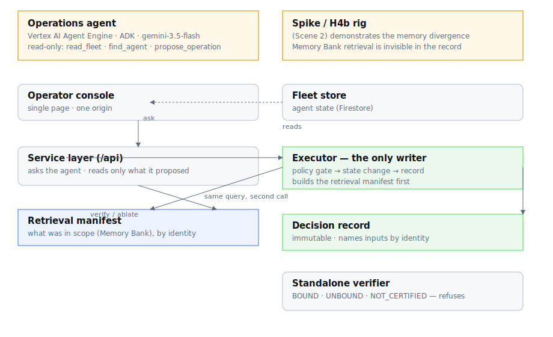

# Governed Agent Operations

An operations agent that manages a fleet of other agents — register, promote, quarantine,
roll back — where every action it takes carries a record that **binds the retrieval set it
decided from**.

> When an autonomous agent makes a decision, can you prove exactly why it was allowed to do it?

## The one shot

```
  One request, run twice. Between them, one memory written by another process.

                            GOOGLE'S RECORD                THE GOVERNED RECORD

  request                   byte-identical                 byte-identical
  code / config changed     none                           none
  outcome                   ESCALATE → BLOCKED  ← moved    invoice-classifier → billing-reconciler

  fact text kept            yes, verbatim                  yes, by SHA-256
  memory identities named   0 — in any file                every selection, by revision
  population in scope       absent                         3 → 4
  anything excluded?        unrecorded                     0 → 1
  what displaced it         unrecoverable                  4 at distance 0.19

  verifier's answer         cannot explain the move        BOUND
  binding stripped          —                              UNBOUND — refuses to certify
```

```bash
python3 scripts/frame.py      # bare python3, no credentials, no network
```

The left column is read out of `evidence/h4b-*.sse` — real captured output from the
2026-08-18 probe run — and nothing is parsed that those files do not literally contain.
The right column is computed through the production manifest builder and the production
verifier on a deterministic store: it is the record shape, not a replay of the run on the
left, and the frame says so rather than letting the two blur together.

The script exits non-zero without printing if the captured runs stop diverging, if a memory
identity ever appears in the evidence, or if the verifier stops separating a bound record
from a stripped one.

## Architecture



Two engines, four components under the operator's control. The **operations agent** — a
native ADK agent on Vertex AI Agent Engine, `gemini-3.5-flash`, three read-only tools —
resolves what an operator means and *proposes*; it never performs. The **executor**, the only
component that can write, runs the deterministic policy gate, performs the state change, and
appends the decision record — building the retrieval manifest *first*, so it describes what
was in scope rather than what happened afterwards. The **decision record** carries that
manifest by identity; the **standalone verifier** classifies it with no credentials. The
**spike / H4b rig** (the second engine) is the Scene 2 divergence demonstration, kept as part
of the entry. `docs/architecture.svg` is the editable source of the diagram.

## Why this exists

On Google's agent platform, a decision's *inputs* are not recorded the way its *output* is.
Memory Bank retrieval returns the top three matches out of a population of any size, and the
cut is invisible: the trace captures the text that was injected into the prompt, but carries
no memory resource name and no revision ID — while memory revisions are first-class versioned
resources with their own identifiers. Memory reads are not audited at all; writes are.

Measured on live infrastructure: with 21 memories in scope, an agent resolved one referent
and returned one determination. A single additional memory, written by an unrelated process —
no code change, no config change — displaced one of the three winners, and the identical
request returned a different determination. Nothing in the platform's own record explains the
change.

This project records what the platform does not: which records were selected, out of what
population, and which versioned record the injected text came from.

**Live:** https://gao-597227190850.us-central1.run.app

## The four operations

| operation | effect | gate |
|---|---|---|
| `register` | admits a new agent to the fleet | must name an owner and a purpose; refuses if the agent already exists |
| `promote` | candidate → active | needs a current attestation and no open incident |
| `quarantine` | → quarantined, refusing traffic | never blocked by a fact; the operator must state a cause |
| `rollback` | pins the agent to its previous revision | needs a previous revision to exist |

A rollback leaves the state alone and moves the *revision* — the agent stays in service, on
different code — and the record names both revisions, because `active -> active` alone is
indistinguishable from having done nothing. Afterwards there is no further known-good
revision, so a second rollback is refused rather than rolling forward onto the code that was
just withdrawn.

## Status

Built and deployed for the All Things Agentic hackathon: the fleet state machine, the fleet
store, the deterministic policy gate, the retrieval manifest, the hash-chained ledger, the
executor, the ADK agent on Vertex AI Agent Engine, the console, the standalone verifier and
the ablation.

## Running the tests

```bash
python -m venv .venv
.venv/bin/pip install -e ".[test]"
.venv/bin/python -m pytest tests/ -q
```

The suite runs offline with no credentials. To additionally exercise the store contract
against live Firestore:

```bash
GOOGLE_CLOUD_PROJECT=<project> GAO_LIVE_TESTS=1 .venv/bin/python -m pytest tests/ -q
```

## Running the console

```bash
GOOGLE_CLOUD_PROJECT=<project> GAO_ENGINE_ID=<reasoning engine id> \
  .venv/bin/uvicorn ops.service:app --port 8811
```

`/` serves the console; `/api/fleet`, `/api/ask`, `/api/decisions` are the surface behind it.
An unset `GAO_ENGINE_ID` returns 503 naming the variable, so a misconfiguration never reads
as a failure to decide.

The console's record pane also surfaces `/api/decisions/{hash}/verify` (the capability class a
third party can establish) and `/api/decisions/{hash}/ablate` (the four-arm necessity test,
inline), plus a two-record comparison that pins decisions and diffs their retrieval manifests.
The divergence and the record-that-catches-it are both visible in the browser, not only in
scripts.

## Verifying a record without us

The verifier is standalone: no credentials, no network, no dependencies beyond the standard
library. It reports a capability class, never a percentage — either a record binds its inputs
by identity or it does not.

| class | what the evidence supports |
|---|---|
| `BOUND` | identities, population, continuous chain, and the manifest agrees with the exported trace |
| `BOUND_UNCORROBORATED` | all of the above, but no trace was exported to check the manifest against |
| `UNBOUND` | the record names what was used, but not which versioned record it was, or not what it was drawn from |
| `NOT_CERTIFIED` | the chain is broken, a hash does not match, or the retrieval field is absent |

`BOUND_UNCORROBORATED` is what a record earns on its own. The manifest is built by the
executor's own call to Memory Bank, not by observing the agent's retrieval — so without a
trace to compare against, "this is what was in scope" and "this is what the model saw" are
different claims, and this verifier will not collapse them.

`BOUND` is reachable, and reaching it means exporting Google's trace alongside the records:

```bash
GOOGLE_CLOUD_PROJECT=<project> python3 scripts/export_bundle.py --out bundle.json
```

The `call_llm` span carries the full prompt, and the injected memories sit in it inside a
`<PAST_CONVERSATIONS>` block. Hashing those and comparing them to the manifest's
`fact_sha256` values turns the gap into a checked property. Measured on live data: an
exported bundle verifies **`BOUND`**; add one fact to the trace that the manifest does not
list and it drops to **`UNBOUND — manifest and trace disagree: 3 recorded, 4 injected, 3 in
common`**. A disagreement is reported, never smoothed into a pass.

Traces are matched to records by their fact hashes, because nothing links the two: the record
is ours and the trace is Google's, and that missing link is part of what this project is
about. A trace is attached only on an exact match; a record that finds none is exported bare
and verifies as `BOUND_UNCORROBORATED`.

## The ablation

```bash
python3 scripts/ablation.py
```

Four arms through the production verifier, testing whether the retrieval binding is doing any
work. It exits non-zero if an arm lands where it should not, and that failure path is
verified by deliberately breaking the verifier — an ablation that has never failed is not
known to be able to fail.

```
PASS  intact                 BOUND
PASS  identities stripped    UNBOUND
PASS  population stripped    UNBOUND
PASS  manifest removed       NOT_CERTIFIED
```

The middle two arms are the interesting ones: they are what an ordinary observability record
looks like. It knows what the model was shown; it does not know which versioned record that
came from, or what else was in scope and lost.

## Rehearsing the demo

```bash
GOOGLE_CLOUD_PROJECT=<project> python3 scripts/rehearse.py
```

Ten checks against the live deployment, run before any recording session. On a sister project
a whole layer turned out never to have been wired into the write path, and it was found by
rehearsing the demo rather than by the tests — the tests covered the layer, not its absence
from the path.

## What the divergence looks like

Two records, same operator, same words, same policy revision. Between them, one memory was
written by an unrelated process — no code change, no config change:

| | record A | record B |
|---|---|---|
| target | `invoice-classifier` | `billing-reconciler` |
| in scope | 3 | 4 |
| selected | 3 | 3 |
| excluded | 0 | 1 |

`python3 scripts/frame.py` prints this beside what the platform kept for the same
divergence, and computes both halves rather than restating this table.

Google's own trace carries the text that was injected into each prompt, and no memory
identity or revision. These records name which versioned records were selected, how many were
in scope, and how many lost.

## License

Apache-2.0.

## Where the model runs

`GEMINI_LOCATION` (default `global`) sets where the model is served — separately from where
the agent is deployed, which stays `us-central1` because the engine and its memory service
live there.

`global` routes to wherever the model actually is, which is why it is the default. It is
**not** insulation from quota: it has its own pool, and that pool can exhaust while the
regional endpoints still serve. Measured 2026-08-19 — `global` returned **429
RESOURCE_EXHAUSTED** while `europe-west2` and `asia-southeast1` both returned 200. Moving the
model is a redeploy of the engine with the variable set, and nothing else changes:

```bash
GEMINI_LOCATION=europe-west2 python deploy/agent_engine.py --update <resource>
```

## Reproducing the demo

```bash
GOOGLE_CLOUD_PROJECT=<project> GAO_ENGINE_ID=<engine> python3 scripts/seed_demo.py
```

Clears the ledger, fleet, facts and operator memories, then writes back the starting position
the four scenes need. `invoice-classifier` is seeded with **no** attestation record on
purpose — an absent record is not an empty one, and the `ESCALATE` beat depends on that
difference being real rather than staged.

Re-run it after a rehearsal: the rehearsal writes real records, and a demo that opens on a
ledger full of test traffic tells the wrong story.
